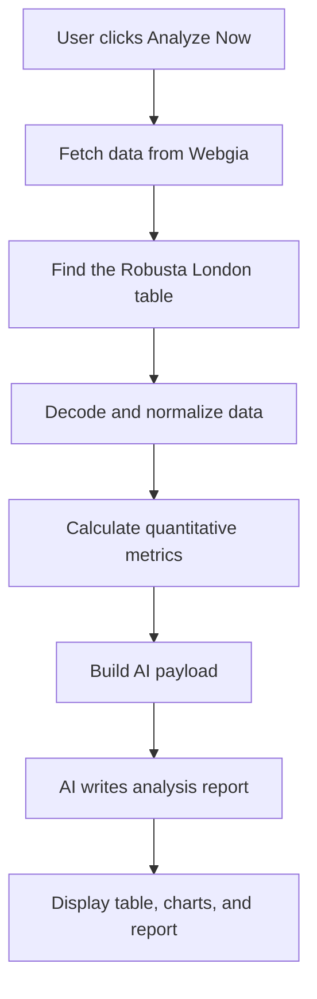
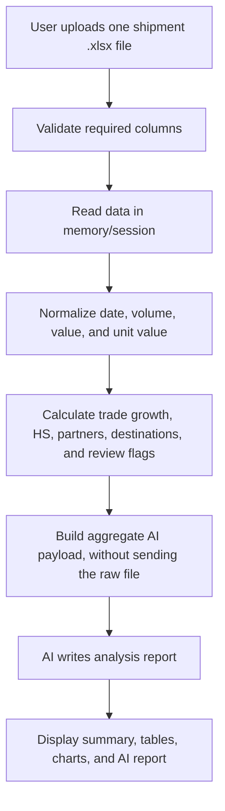

# Coffee Market AI Analyzer

A Streamlit app for analyzing Robusta London coffee prices and coffee import/export shipment data from Excel files.

## Main Features

- **Robusta London price analysis**: fetches Webgia data, parses the Robusta London table, normalizes prices, calculates market metrics, and generates an AI report.
- **Coffee import/export Excel analysis**: uploads one shipment `.xlsx` file, validates the required structure, analyzes volume/value/unit value/HS and data points that need review, then generates an AI report from aggregated data.

## Processing Workflow

### 1. Robusta London Price Analysis



### 2. Import/Export Excel Analysis



## Run Locally

```powershell
python -m venv .venv
.\.venv\Scripts\Activate.ps1
pip install -r requirements.txt
Copy-Item .env.example .env
streamlit run app.py
```

## Configuration

Create `.env` from `.env.example`:

```text
GEMINI_API_KEY=your_api_key_here
SOURCE_URL=https://webgia.com/gia-hang-hoa/ca-phe-the-gioi/
GEMINI_MODEL=gemini-3.1-flash-lite
```

Without `GEMINI_API_KEY`, the app still shows the rule-based quantitative analysis.

## Streamlit Deployment

For Streamlit Community Cloud:

- Main file path: `app.py`
- Dependencies: `requirements.txt`
- Secrets: add `GEMINI_API_KEY` if AI reports are required.
